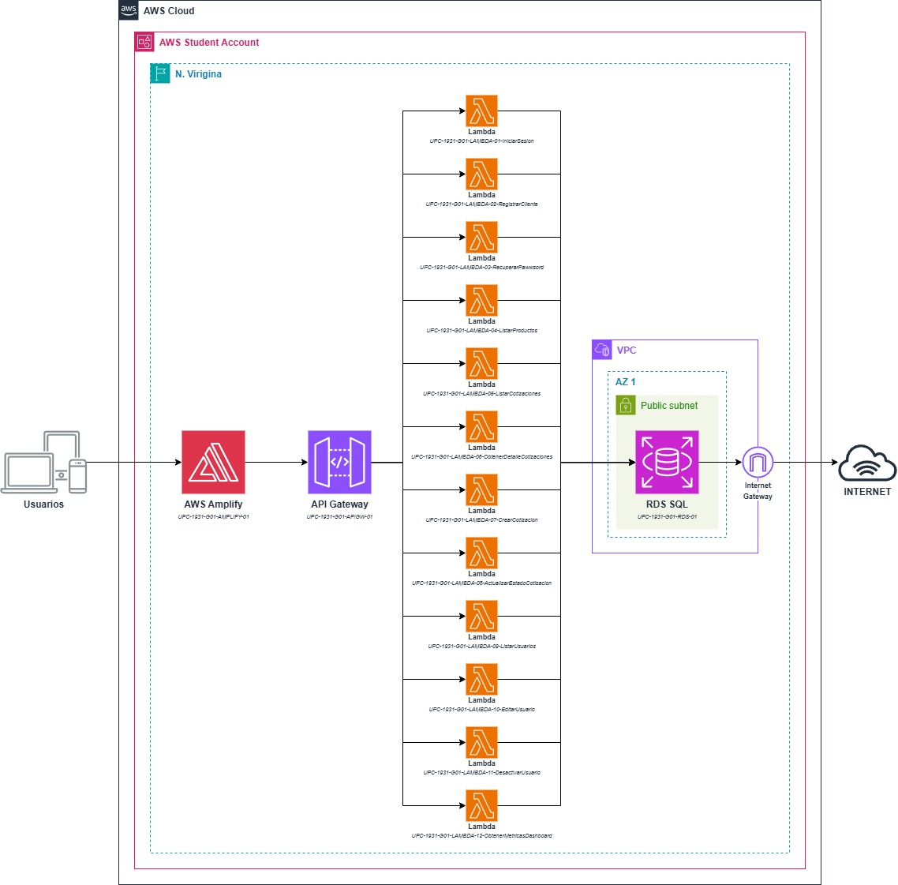

## Documentación de API y Lambdas
Para ver el detalle de las rutas del API Gateway y sus Lambdas asociadas, revisa la siguiente tabla que describe cada microservicio del sistema.

| Módulo | HU Asociada | Método | Path (API Gateway) | Nombre del Lambda (AWS) | Funcionalidad (Descripción) |
| :--- | :--- | :---: | :--- | :--- | :--- |
| **Auth** | HU-02 | `POST` | `/api/v1/auth/login` | `UPC-1931-G01-LAMBDA-01-iniciarSesion` | Valida correo/contraseña y retorna el token JWT junto con el rol del usuario. |
| **Auth** | HU-01 | `POST` | `/api/v1/auth/registro` | `UPC-1931-G01-LAMBDA-02-registrarCliente` | Inserta un nuevo usuario en la tabla `users` con el rol predeterminado de 'cliente'. |
| **Auth** | HU-09 | `POST` | `/api/v1/auth/recuperar` | `UPC-1931-G01-LAMBDA-03-recuperarPassword` | Genera y almacena el token en `password_resets` para la recuperación de cuenta. |
| **Catálogo** | HU-03 | `GET` | `/api/v1/productos` | `UPC-1931-G01-LAMBDA-04-listarProductos` | Retorna los productos de la tabla `products` con estado 'activo' para armar el carrito. |
| **Cotizaciones** | HU-03, HU-05 | `GET` | `/api/v1/cotizaciones` | `UPC-1931-G01-LAMBDA-05-listarCotizaciones` | Retorna el listado de cotizaciones. Recibe query params (`?clienteId=` o `?estado=`) para filtrar según quién lo pide. |
| **Cotizaciones** | HU-05 | `GET` | `/api/v1/cotizaciones/{id}` | `UPC-1931-G01-LAMBDA-06-obtenerDetalleCotizacion` | Hace un JOIN para traer la cabecera (`quotations`), los productos (`quotation_items`) y observaciones. |
| **Cotizaciones** | HU-04 | `POST` | `/api/v1/cotizaciones` | `UPC-1931-G01-LAMBDA-07-crearCotizacion` | Registra la nueva cotización y hace un bulk insert de los productos del carrito. |
| **Cotizaciones** | HU-06, HU-07 | `PATCH` | `/api/v1/cotizaciones/{id}/estado` | `UPC-1931-G01-LAMBDA-08-actualizarEstadoCotizacion` | Cambia el estado a Aprobada, Observada o Rechazada e inserta el registro en `quotation_status_history`. |
| **Usuarios** | HU-08 | `GET` | `/api/v1/usuarios` | `UPC-1931-G01-LAMBDA-09-listarUsuarios` | Uso exclusivo del Admin. Retorna la lista de usuarios y roles del sistema. |
| **Usuarios** | HU-08 | `PUT` | `/api/v1/usuarios/{id}` | `UPC-1931-G01-LAMBDA-10-editarUsuario` | Uso exclusivo del Admin. Permite modificar los datos básicos y el rol de un usuario existente. |
| **Usuarios** | HU-09* | `PATCH` | `/api/v1/usuarios/{id}/estado` | `UPC-1931-G01-LAMBDA-11-desactivarUsuario` | Cambia el campo `status` a 'inactivo' para restringir accesos sin borrar el historial (Soft delete). |
| **Reportes** | HU-10 | `GET` | `/api/v1/reportes/dashboard` | `UPC-1931-G01-LAMBDA-12-obtenerMeticasDashboard` | Ejecuta las consultas de agregación (SUM, COUNT) para alimentar los gráficos de ng2-charts del administrador. |

## Arquitectura de AWS

Puedes editar el diagrama usando el archivo fuente [arquitectura-aws.drawio](arquitectura-aws.drawio) en Draw.io.